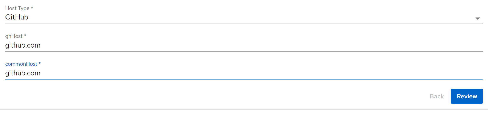
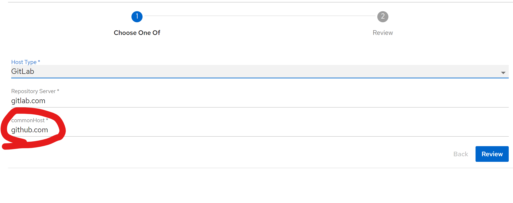
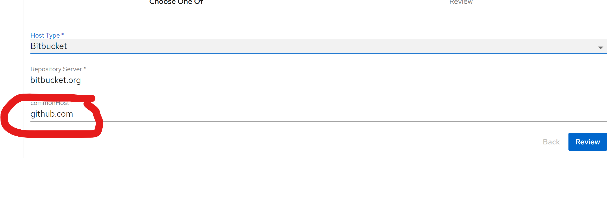

# oneof

Import the template.

It uses the oneOf: chooser

Each choice has a unique key and a common property.
Default values do not get updated when a common property name is used. 

For unique keys, defaults provided will appear correctly
For the common property only the first value appears and the other defaults are ignored.

Expected behavior, when a new choice is made, the common field is updated with its default value. 

Correct for first choice

switch to gitlab and the common does not change to its default

switch to bitbucket and the common does not change to its default
 